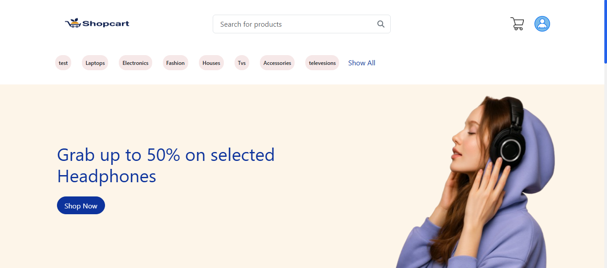
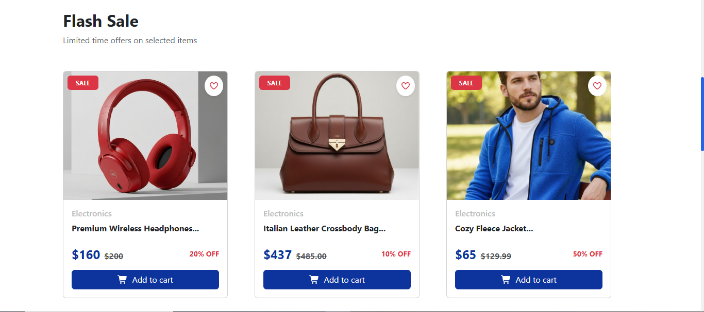
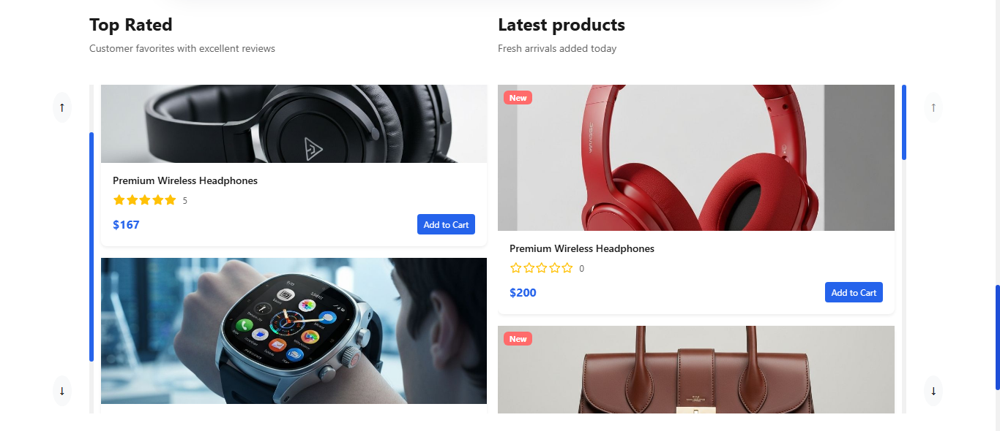
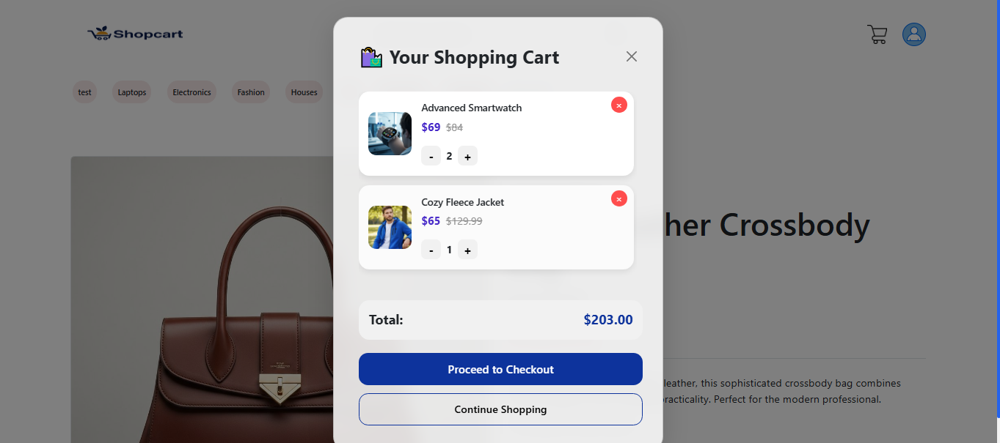

# 🚀 React Dashboard & E-Commerce Application

A modern **responsive Dashboard & E-Commerce web application** built with **React** and **Bootstrap 5**.
The project is designed to simulate a real online store and admin system for learning and portfolio purposes.

---

## ✨ Features

### 🖥️ Dashboard

* Analytics cards (Users, Products, Orders, Categories)
* Charts & statistics (optional)
* Responsive layout (Desktop / Tablet / Mobile)
* Sidebar navigation
* Dark / Light friendly UI

### 🛒 E-Commerce

* Products listing page
* Product details page
* Add to cart functionality
* Update & delete from cart
* Fake checkout system (Simulation)
* Thank you page after order
* Responsive design for all devices

### 🔐 Authentication (optional)

* Login page
* Register page
* Form validation

---

## 🧰 Technologies Used

* **React.js**
* **React Router DOM**
* **Bootstrap 5**
* **FontAwesome / React Icons**
* **Context API / useState / useEffect/ useRef**
* **Fake API / Local Storage** for data

---

## 📸 Screenshots

Add your screenshots here:

```md







```

---

## ⚙️ Installation & Setup

Clone the repository first:

```bash
git clone https://github.com/your-username/project-name.git
```

Go to project folder:

```bash
cd project-name
```

Install dependencies:

```bash
npm install
```

Run the project:

```bash
npm start
```

Project will run on:

```
http://localhost:3000
```

---

## 💳 Fake Payment System

This project uses a **simulated payment system** for testing purposes:

1. User clicks **Place Order**
2. Shows a loading spinner (2-3 seconds)
3. Displays **Payment Successful**
4. Redirects to **Thank You** page

> No real API or payment gateway used.

---

## 📱 Responsive Design

The website is 100% responsive:

* ✅ Desktop
* ✅ Tablet
* ✅ Mobile

Tested using Chrome DevTools and real devices.

---

## 👩‍💻 Author

**Aya Hassan**
Frontend Developer (React js & Bootstrap)
📍 Egypt

### 🔗 Contact

* LinkedIn: [https://www.linkedin.com/in/aya-hassan%F0%9F%87%B5%F0%9F%87%B8-aa8a87231/]
* Portfolio: (add your link)
* GitHub: [https://github.com/AyaHassan55]

---

## 📃 License

This project is for **educational & portfolio** use only.
